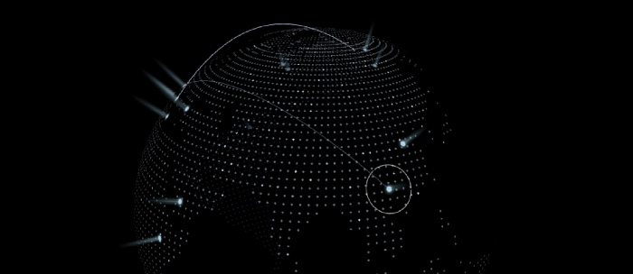

# 3D Earth Banner



## How to Start

install by npm:

```shell
$ npm install @tarii/3d-earth --save
```

use

```javascript
import Earth from '@tarii/3d-earth'

const parent = document.querySelector('#box')
const earth = new Earth({
  parent,
  coords: [29.458349, 106.396826]
})

earth.start()
```

> For more information on input parameters, please refer to `src/index.d.ts`.
